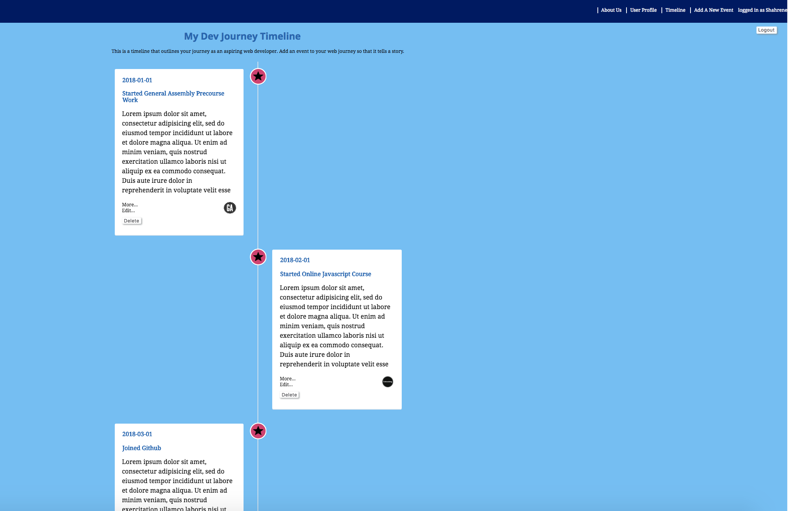

# My Dev Journey
Visit our web app here: http://my-dev-journey.herokuapp.com/

# About us
We are a group of aspiring web developers wanting to execute what we have learnt in class e.g Ruby on Rails, AJAX and JavaScript, html and CSS. This is a group project as part of our WDI-15 course at General Assembly, Melbourne.

## About the web app
This web app aims to encourage other aspiring web developers to create their personal web development journey. Users can create and add events to their timeline. They can also edit and delete events that no longer apply. The web app also allows users to create their user profiles that identify their goals and career summary.

User and event details are saved in SQL database for this project.

## Challenges
The challenges of this web app are identifying the things we would like to build for the MVP (Minial Viable Product) in the days that we were given (4.5 days). The other challenges include making the AJAX functions work e.g toggle/scroll. Finally, working together as a team to communicate ideas, challenges and fix issues that come up during the project.

## Deployment
This web app and the database are built using Ruby on Rails and they will be deployed on Heroku as a final product.

## Technologies Used
Some cool CSS and JavaScript tricks including expanding and collapsing boxes when content has more words than the container allows (Toggling function). Clicking on a link and jumping to a specific section on the body.

## Next Steps

### (things we have identified in the backlog)
- Adding dropdown options to the event boxes to allow users to choose relevant icons for their event.
- Add "forgot password" functionality for the sign up option
- Allow users to change theme for the timeline, for personalisation purposes
- Allow users to export the timeline as PDF so that they can share their web development journey with others e.g recruiters, potential employers if they want to.

